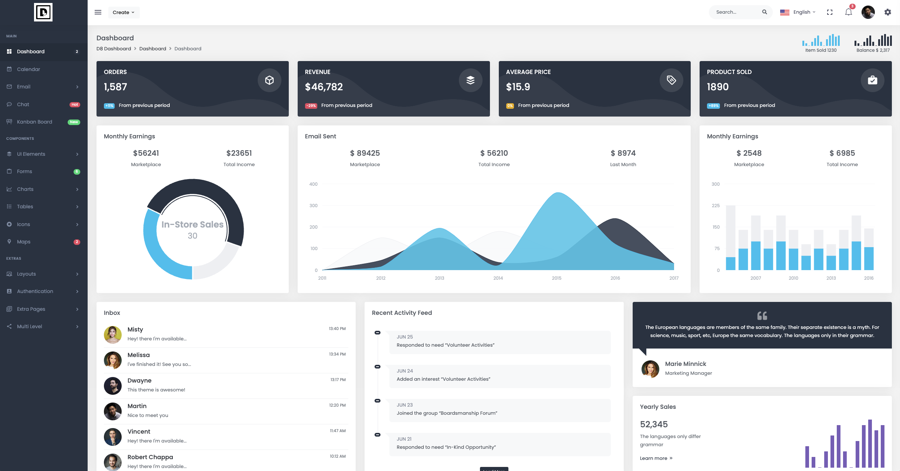

# **Welcome to D8 Dashboard - Your Gateway to Modern Data Management**

  

## About D8 Dashboard

D8 Dashboard is a cutting-edge data management platform with a modern and intuitive design. We have developed a user-friendly interface that allows you to easily navigate and visualize your data in real time. With D8 Dashboard, you can gain valuable insights, make informed decisions, and drive business growth.

## Key Features and Benefits

- **Sleek and Modern Design:** Our dashboard features a sleek and modern design that is visually appealing and enhances user experience. With its clean layout and intuitive navigation, you can effortlessly access and interact with your data.

- **Real-Time Data Visualization:** Instantly visualize your data with our real-time charts, graphs, and visualizations. Easily understand trends, patterns, and correlations, empowering you to make data-driven decisions.

- **Customizable Widgets:** Tailor your dashboard to your specific needs with customizable widgets. Choose from a variety of pre-built widgets or create your own, allowing you to focus on the metrics and data that matter most to your business.

- **Data Integration and Connectivity:** Seamlessly integrate your data from various sources, such as databases, APIs, and third-party applications. With our robust connectivity options, you can centralize your data and view it all in one place.

- **Responsive Design:** Access your dashboard anytime, anywhere, and on any device. Our responsive design ensures that you have a seamless user experience across desktops, laptops, tablets, and mobile devices.

- **Collaboration and Sharing:** Collaborate with your team by sharing dashboards and reports. Keep everyone informed and aligned by granting access to specific users or teams. Enable valuable collaboration and foster data-driven decision-making.

- **Advanced Analytics and Data Insights:** Unlock the power of advanced analytics with our built-in tools and features. Leverage machine learning and predictive analytics to extract meaningful insights from your data, allowing you to stay ahead of the competition.

## Get Started with D8 Dashboard

Experience the power of modern data management with D8 Dashboard:

1. Sign up for a D8 Dashboard account on our website.

2. Connect your data sources to centralize your data.

3. Customize the dashboard layout and widgets to suit your unique requirements.

4. Visualize your data in real time, gain insights, and make informed decisions.

5. Collaborate and share important insights with your team, fostering a data-driven culture.

## Contact Us

If you have any questions, feedback, or need assistance, our dedicated support team is here to help:

- Email: support@d8me.live
- Website: [dashboard.d8me.live](https://dashboard.d8me.live)

Join D8 Dashboard today and embark on a data-driven journey towards success. Streamline your data management, visualize your insights, and unlock the full potential of your data. Let D8 Dashboard empower you to make smarter, more informed business decisions.